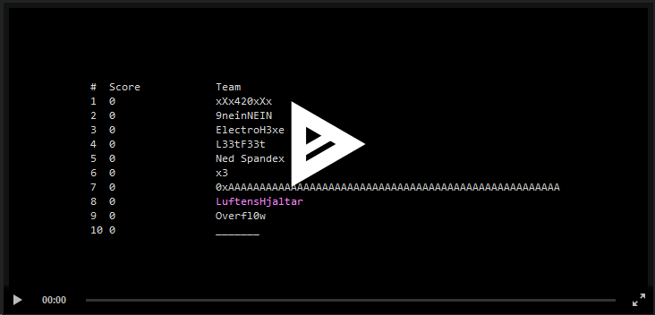

# CTF Terminal Frontend
Fetches and displays live scores from Capture The Flag tournaments in your terminal. With *pep* and *zing*!

## Supported CTF systems:
Shared, open-source systems:
* [rCTF](https://github.com/redpwn/rctf)
* [CTFd](https://ctfd.io)
* [RTB-CTF](https://github.com/abs0lut3pwn4g3/RTB-CTF-Framework)

Custom, one-off or otherwise difficult customers:
* [hxp](https://2020.ctf.link)
* [zer0pts](https://2021.ctf.zer0pts.com/index.html#/)

Support for these one-off systems is based on reverse-engineering of non-public APIs or page scraping. As a result, they may stop working or require some tweaking for future CTFs by the same organizers.

## Example
[](https://asciinema.org/a/mds9ucDsbflnPnrnjFTW9WkcM)

(Click for an animated preview!)

## Usage
```
usage: ctfront.py [-h] [--frontend [FRONTEND [FRONTEND ...]]] [--list-frontends]
                  [--backend BACKEND] [--list-backends] [--poll-interval POLL_INTERVAL]
                  [--config CONFIG] [--url URL] [--auth AUTH] [--username USERNAME]
                  [--password PASSWORD] [--focus-teams [FOCUS_TEAMS [FOCUS_TEAMS ...]]]
                  [--max-length MAX_LENGTH]

Fetch and display a live CTF scoreboard

optional arguments:
  -h, --help            show this help message and exit
  --frontend [FRONTEND [FRONTEND ...]], -f [FRONTEND [FRONTEND ...]]
                        Add a frontend
  --list-frontends, -F  List known frontends
  --backend BACKEND, -b BACKEND
                        Specify a CTF backend
  --list-backends, -B   List known frontends
  --poll-interval POLL_INTERVAL, -i POLL_INTERVAL
                        Seconds between server polling. Don't set this too low!
  --config CONFIG, -c CONFIG
                        Load a configuration file.
  --url URL, -u URL     URL to scoreboard. See backend list for specifics.
  --auth AUTH, -a AUTH  Auth token for scoreboard. See backend list for specifics.
  --username USERNAME, -U USERNAME
                        Username for scoreboard. See backend list for specifics.
  --password PASSWORD, -P PASSWORD
                        Password for scoreboard. See backend list for specifics.
  --focus-teams [FOCUS_TEAMS [FOCUS_TEAMS ...]], -t [FOCUS_TEAMS [FOCUS_TEAMS ...]]
                        One or more team names (regex) to always show
  --max-length MAX_LENGTH
                        Max length of shown scoreboard

```

# Internals
## Backend
Fetches scoreboard and team stats and stuff from a CTF server. Tailor one to whatever score system the event is using.

Optionally implements autodetection ("Does this URL point to a CTF system I can handle?").

## Middle-end
Keeps a running copy of the CTF state and identifies changes. Sends events to the front-end when something interesting changes.

## Front-end
Receives specific updates from the Middle-end and renders it.

Obviously, the front-end is free to ignore events as needed. You could make a front-end which only flashes your keyboard LEDs when `p4` scores points!

## Configuration
Reads `~/.ctfront/config.json` which may look like this (everything in there is optional)

```json
{
   "focus-teams": [ ".uftens.jaltar", "SmygHalloumi" ],
   "max-count": 10,
   "poll-interval": 60,
   "url": "https://ctf.dicega.ng/scores",
   "backend": "auto",
   "frontends": [ "fancy" ]
}

```

# Protocols

## Back -> Middle
Backend sends a snapshot message periodically (poll the server or whatever).

A message is a tuple of `("message_type", { "data" : 1234 })` as specified below:
Most fields may be omitted if unknown. Middle-end will treat this as "No change".
The top-level list (`scores` and `challenges`) must be a complete listing.

`team_id` and `challenge_id` are *mandatory* and decided by the backend. These must remain stable throughout the tournament. If the server doesn't provide something suitable, hash the team name or something.


```python
(
    "scoreboard",
    {
        "scores": [
                     {
                        "team_id": "team_id_1",
                        "name": "LuftensHjaltar",
                        "place": 69,
                        "score": 31337
                     },
                     ...
                  ]
    }
)
```


```python
(
    "challenges",
    {
        "challenges" = [
                           {
                               "challenge_id" : "challenge_x",
                               "solves": [ "team_1", ... ],
                               "name": "S4n1ty Ch3ck",
                               "points": 25,
                               "categories": [ "pwn", "re" ]
                           },
                            ...
                       ]
    }
)
```


## Middle -> Front

Middle-end sends individual events to the frontend when something changes.

Omitted fields indicate that data is not available, so frontend should format accordingly (i.e. if no team has a "score" field, don't show a score column).

```python
(
    "boot",
    {
        "scoreboard": {  same format as scoreboard snapshot  }
        "challenges": {  same format as challenges snapshot  }
    }
)
```

```python
(
    "solve",
    {
        "team_id": "team_1",
        "challenge_id": "challenge_x",
        "first": True
    }
)
```

```python
(
    "place",
    {
        "team_id": "team_1",
        "old_place": 69,
        "place": 65
    }
)
```

```python
(
    "score",
    {
        "team_id": "team_1",
        "old_score": 1335,
        "score": 2001
    }
)
```

```python
(
    "new_challenge",
    {
        "challenge_id": "challenge_x",
        "name": "Grognar's Revenge",
        "points": 500,
        "solves": [ "team_id_a", "team_id_b" ],

        "categories": [ "pwn", "re" ]
    }
)

```

```python
(
    "new_team", { Same format as a team on the scoreboard }
)
```

# TODO

## Backends
* JustCTF
* [ctf4hire](https://ctf4hire.com/info)
* [picoCTF](https://github.com/picoCTF/picoCTF)
* [MITRE](https://github.com/mitre-cyber-academy/ctf-scoreboard)
* [google](https://github.com/google/ctfscoreboard)
* Some customizable "Scrape and parse a table" backend?
  * Maybe that can make it easier to rig a custom one-use backend on demand?
  * For now, take a look at `backends/hxp.py` for an example of beautifulsoup
* ...

A global (persistent) cookie jar to keep from having to authenticate new sessions on every restart

## Frontend

Support is in place for multiple frontends active at the same time, so maybe one for sound, one for video, one for external lighting effects, etc.

